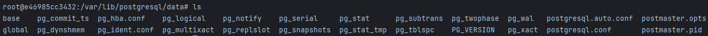

# Keycloak / PostgresSQL

* [Lancement](#Lancement)
* [Accès_PostgreSQL](#Accès_PostgreSQL)
* [Documentation](#Documentation)

### Lancement

Avant de lancer ce script vérifier que le service docker soit en cours d'excution  
Sur ubuntu

```shell
sudo service docker status
```

Ou verifier qu'il y a un processus docker en cours d'excution, cela permettra d'avoir l'information
sur l'état de docker

```shell
docker version
```

Pour lancer l'exécution de ce projet après l'avoir récupéré de dépôt, vous devez modifier les droits
d'exécution du fichier `init.sh`.

Voici la commande à exécuter :

```shell
sudo chmod +x init.sh
```

Ce script créera les dossiers `keycloak_home` et `postgres_home` avec les droits utilisateur de la session.


Lancement des script python
```shell
python3 [myScript.py]
```


## Accès_PostgreSQL

L'accès au volume PostgreSQL exécuter la commande

```shell
docker exec -ti postgres-db bash
```

Puis dans le contneur postgres-db

```shell
cd /var/lib/postgresql/data
```



### Documentation

1. Keycloak

* Les variables d'environment de base, voir le [docker hub](https://hub.docker.com/r/jboss/keycloak)
* Le dépôt Red hat de l'image basé sur
  Quarkus [RED HAT Quay.io](https://quay.io/repository/keycloak/keycloak/manifest/sha256:cee8a0b343993b699a3d3eeb90e0b1eca2fa19285a413200af9785db8b00dcd7)

2. PostgreSQL

* La documenation de ce projet , voir le [docker hub](https://hub.docker.com/_/postgres)
* La version de ce
  projet [postgres:15.2-bullseye](https://hub.docker.com/layers/library/postgres/15.2-bullseye/images/sha256-6b91d38a9c596fa4e6a1276f6f81810882d9f292a09f9cf2647c6a554c8b6d00?context=explore)